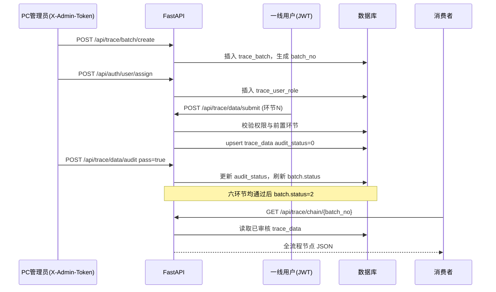

# 溯源全流程上报与权限说明

## 1. 权限管控逻辑

- **环节权限模型**：角色表 `trace_sys_role.permissions` 为 JSON 数组，元素为环节 key：`picking`（茶园采摘）、`processing`（初制加工）、`qc`（品质质检）、`warehouse`（仓储入库）、`logistics`（物流发货）、`sales`（终端销售）。`["*"]` 表示溯源超级权限（可填报任意环节，且可查看他人修改日志等，与管理员令牌配合使用）。
- **用户绑定**：`trace_user_role` 将小程序用户 `users.id` 与角色关联；接口 `GET /api/auth/user/permission` 返回合并后的环节列表（多角色权限并集）。
- **管理员令牌**：请求头 `X-Admin-Token` 等于环境变量 `ADMIN_TOKEN` 时，视为 PC 管理端，可建批次、分配角色、审核数据；修改已审核数据时保留审核通过状态（并写入 `trace_data_log`）。
- **一线用户（JWT）**：仅可调用 `POST /api/trace/data/submit` 等有 JWT 校验的接口；服务端校验 `can_operate_stage` 与 `prev_stages_all_approved`（前一环节必须均已审核通过才可填报下一环节）。
- **数据不可删除**：环节数据与日志仅追加；修改走 `POST /api/trace/data/update` 并写入 `trace_data_log`。
- **消费者展示**：`GET /api/trace/chain/{trace_no}` 当存在对应 `trace_batch` 且 `status=2`（全环节已审核完成）时，返回库内已审核 JSON；否则回退演示模板。

## 2. 上报流程时序图

## 3. 扩展方式

- **新增环节**：在 `app/trace_workflow_core.py` 的 `STAGES_ORDER` / `STAGE_LABELS` 追加 key；种子角色 `permissions` 中加入该 key；消费者组装逻辑按顺序读取 `TraceData`。
- **新增角色**：向 `trace_sys_role` 插入一行即可，无需改代码。
- **调整权限**：更新对应行的 `permissions` JSON 数组。
